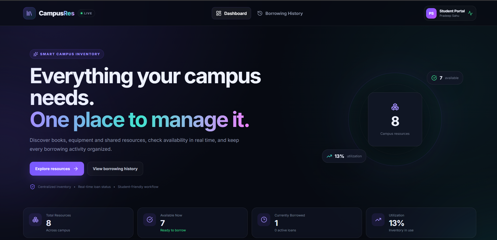
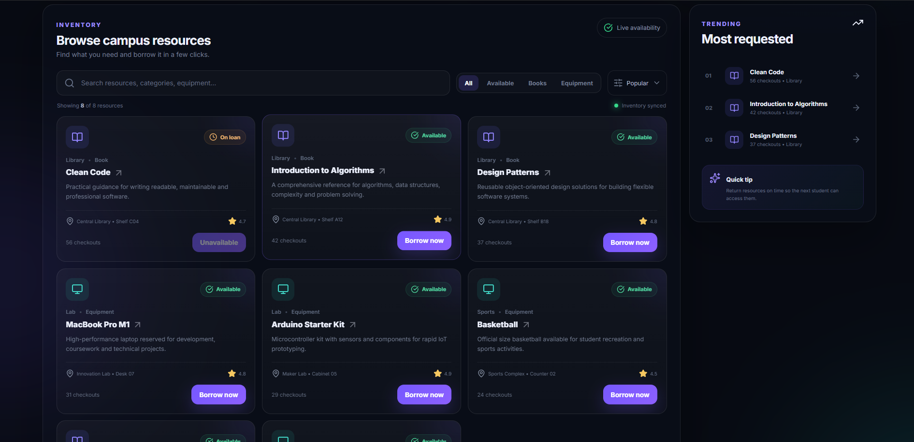
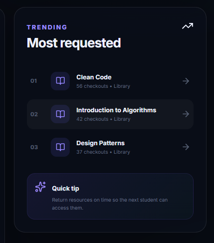
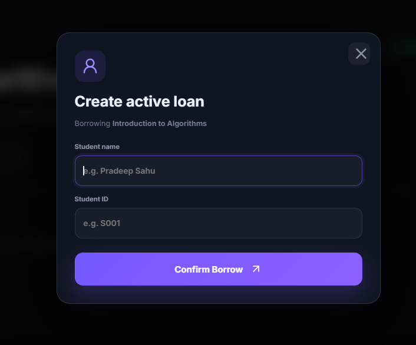
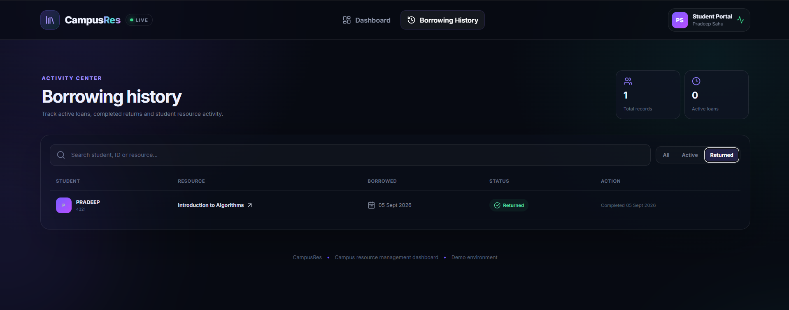

# CampusSync — Smart Campus Resource Management Dashboard

A polished React + TypeScript dashboard for managing shared campus resources such as books, laptops, lab equipment and sports inventory.

## ✨ Highlights
- Premium responsive dashboard UI
- Live inventory statistics and utilization overview
- Search, category filters and sorting
- Resource detail pages
- Borrow workflow with student validation
- Borrowing history with Active / Returned filters
- Return-resource workflow
- Trending / most-requested resources
- Responsive mobile layout
- Lucide icons and reusable React components
- Context + reducer based state management

## 🧰 Tech Stack
React 19 • TypeScript • Vite • React Router • Lucide React

## 📸 Screenshots

### Dashboard


### Campus Resource Inventory


### trending


### issue


### Borrowing And Return inventory


## 🚀 Run locally
```bash
npm install
npm run dev
```

## 📦 Production build
```bash
npm run build
```

## 📁 Project structure
- `src/components` — reusable UI components
- `src/pages` — dashboard, history and resource detail pages
- `src/context` — application state and borrowing actions
- `src/types` — TypeScript domain models

> This is a frontend demo using mock inventory data. It is intentionally structured so a REST API / Firebase / Supabase backend can be integrated later.
